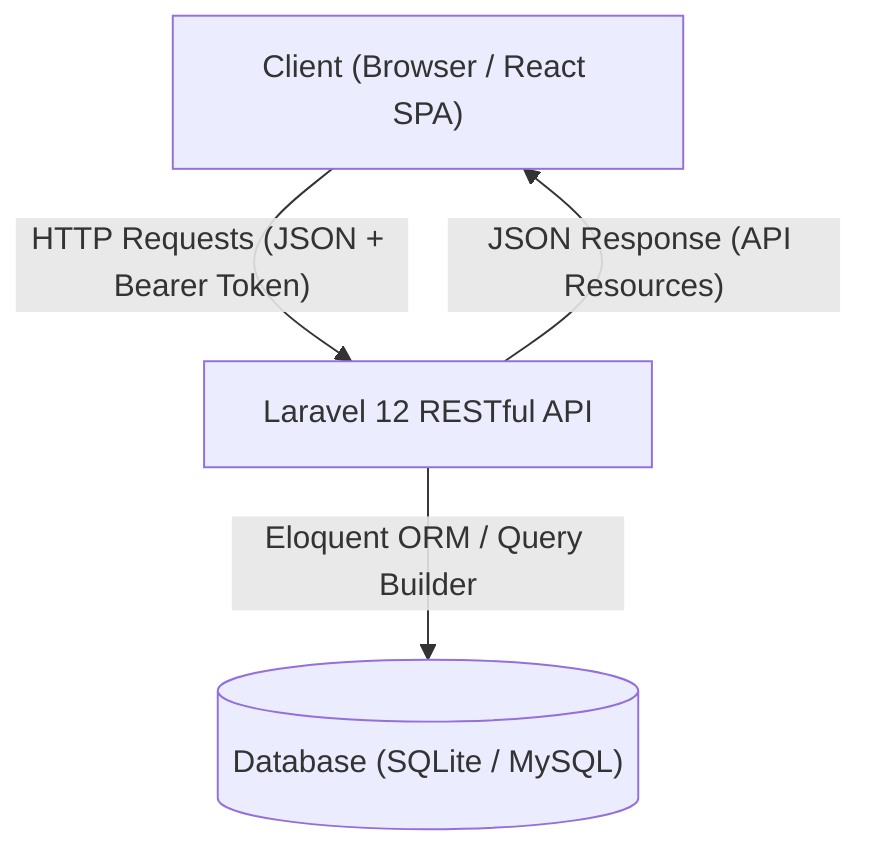
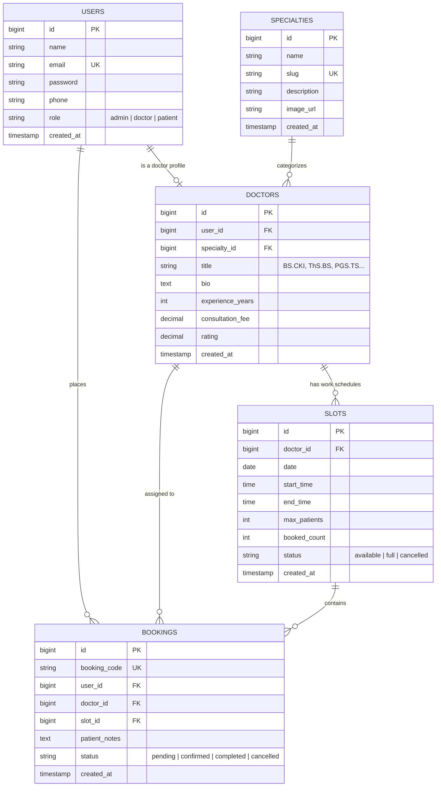
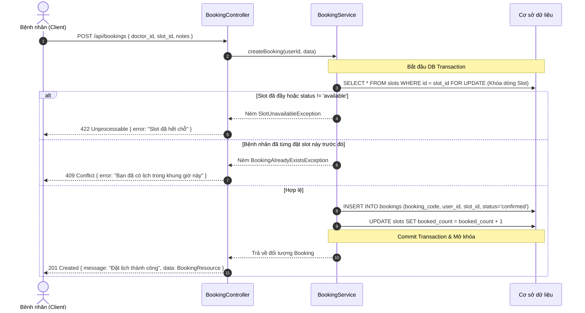

# YouMed-Mini — Hệ Thống Đặt Lịch Khám Bệnh Trực Tuyến

> Dự án mô phỏng nền tảng đặt lịch khám bệnh theo mô hình YouMed, áp dụng kiến trúc tách rời (**Decoupled Client-Server Architecture**): **Laravel 12 API Only** ở Backend và **React + Vite + Tailwind CSS + shadcn/ui** ở Frontend.

---

## 📑 Mục lục
1. [Tổng quan dự án](#1-tổng-quan-dự-án)
2. [Kiến trúc hệ thống](#2-kiến-trúc-hệ-thống)
3. [Cấu trúc thư mục chi tiết](#3-cấu-trúc-thư-mục-chi-tiết)
4. [Mô hình dữ liệu (Database Schema & ERD)](#4-mô-hình-dữ-liệu-database-schema--erd)
5. [Quy chuẩn API & Luồng nghiệp vụ cốt lõi](#5-quy-chuẩn-api--luồng-nghiệp-vụ-cốt-lõi)
6. [Hướng dẫn cài đặt và chạy dự án](#6-hướng-dẫn-cài-đặt-và-chạy-dự-án)
7. [Quy ước phát triển và xử lý lỗi](#7-quy-ước-phát-triển-và-xử-lý-lỗi)
8. [Kế hoạch tài liệu (`docs/`)](#8-kế-hoạch-tài-liệu-docs)

---

## 1. Tổng quan dự án

### 1.1. Mục tiêu
Xây dựng một hệ thống đặt lịch khám bệnh gọn nhẹ nhưng chuẩn chỉ về mặt kỹ thuật công nghệ thông tin và tiêu chuẩn phát triển phần mềm hiện đại:
- **Hiệu năng & Trải nghiệm:** Tốc độ phản hồi nhanh, giao diện hiện đại, thân thiện, dễ tương tác trên cả desktop và thiết bị di động.
- **Độ tin cậy cao:** Đảm bảo tính toàn vẹn dữ liệu trong quá trình đặt lịch, giải quyết triệt để bài toán **tranh chấp slot (Race Condition / Overbooking)** khi nhiều bệnh nhân cùng đặt một khung giờ khám.
- **Dễ bảo trì & Mở rộng:** Phân tách rõ ràng giữa HTTP layer, Validation layer, Business logic layer và Data access layer.

### 1.2. Các nhóm người dùng (Roles)
1. **Bệnh nhân (Patient):**
   - Đăng ký / Đăng nhập tài khoản cá nhân.
   - Tìm kiếm bác sĩ theo chuyên khoa, tên bác sĩ, giá khám, đánh giá.
   - Xem lịch làm việc và các khung giờ còn trống (Available Slots) của bác sĩ.
   - Đặt lịch khám, nhập mô tả triệu chứng, nhận mã phiếu khám.
   - Xem lịch sử đặt khám và hủy lịch nếu chưa tới hạn.
2. **Bác sĩ (Doctor):**
   - Xem lịch khám của chính mình theo ngày/tuần.
   - Cập nhật hồ sơ bác sĩ (chuyên khoa, số năm kinh nghiệm, học hàm/học vị, tiểu sử, giá khám).
3. **Quản trị viên (Admin):**
   - Quản lý danh mục Chuyên khoa (Thêm, Sửa, Xóa, Ảnh đại diện).
   - Quản lý Bác sĩ (Thêm mới bác sĩ, liên kết tài khoản, phân chuyên khoa).
   - Quản lý Ca khám / Khung giờ (Khởi tạo slot khám theo ngày/khung giờ).
   - Quản lý toàn bộ danh sách phiếu đặt hẹn khám, duyệt/hủy lịch hẹn.

---

## 2. Kiến trúc hệ thống

Dự án áp dụng mô hình **Client - Server RESTful API**:



### 2.1. Backend: Service Layer & Custom Exceptions Pattern
Thay vì viết toàn bộ logic vào Controller (gây phình to Fat Controller), hệ thống phân tách thành 5 tầng rõ rệt:

1. **Routing & Middleware:** 
   - Định tuyến API tại `routes/api.php`.
   - `CheckRole` middleware kiểm tra quyền truy cập theo vai trò (`admin`, `doctor`, `patient`).
   - `auth:sanctum` xác thực Bearer Token.
2. **Form Requests (`app/Http/Requests`):**
   - Đảm nhiệm việc validate dữ liệu đầu vào, định nghĩa rules và thông báo lỗi.
   - Controller chỉ nhận dữ liệu đã qua kiểm duyệt hợp lệ (`$request->validated()`).
3. **Controllers (`app/Http/Controllers/Api`):**
   - Nhận request, gọi Service tương ứng để xử lý nghiệp vụ.
   - Nhận kết quả từ Service và bọc qua API Resource để trả về client với HTTP Status Code phù hợp.
4. **Services (`app/Services`):**
   - Nơi chứa **100% Business Logic**.
   - Quản lý Database Transactions (`DB::transaction`).
   - Quản lý khóa chống đặt trùng (Pessimistic Locking `lockForUpdate` trên Slot).
   - Ném các Custom Exception mang tính nghiệp vụ khi vi phạm điều kiện.
5. **Custom Exceptions (`app/Exceptions`):**
   - Các ngoại lệ cụ thể như `SlotUnavailableException`, `BookingAlreadyExistsException`, `DoctorNotFoundException`, `InvalidCredentialsException`.
   - Giúp mã nguồn rõ nghĩa, tập trung xử lý format lỗi JSON thống nhất tại `bootstrap/app.php`.

---

## 3. Cấu trúc thư mục chi tiết

```
youmed-mini/
│
├── backend/                                      [Laravel 12 — API only]
│   ├── app/
│   │   ├── Exceptions/                           [Custom Business Exceptions]
│   │   │   ├── BusinessException.php             [Exception cha cho toàn bộ lỗi nghiệp vụ]
│   │   │   ├── Auth/
│   │   │   │   └── InvalidCredentialsException.php
│   │   │   ├── Booking/
│   │   │   │   ├── SlotUnavailableException.php  [Báo lỗi khi slot đã bị người khác đặt hết]
│   │   │   │   ├── BookingAlreadyExistsException.php [Báo lỗi khi user đã đặt slot này rồi]
│   │   │   │   └── BookingNotFoundException.php
│   │   │   └── Doctor/
│   │   │       ├── DoctorNotFoundException.php
│   │   │       └── DoctorUnavailableException.php
│   │   │
│   │   ├── Http/
│   │   │   ├── Controllers/
│   │   │   │   └── Api/
│   │   │   │       ├── AuthController.php        [Đăng ký, Đăng nhập, Hồ sơ, Đăng xuất]
│   │   │   │       ├── DoctorController.php      [Danh sách bác sĩ, chi tiết bác sĩ, slot trống]
│   │   │   │       ├── BookingController.php     [Bệnh nhân đặt lịch, xem lịch sử, hủy lịch]
│   │   │   │       └── Admin/
│   │   │   │           ├── SpecialtyController.php     [Admin: CRUD chuyên khoa]
│   │   │   │           ├── DoctorAdminController.php   [Admin: CRUD bác sĩ]
│   │   │   │           ├── SlotController.php          [Admin: Tạo khung giờ khám]
│   │   │   │           └── BookingAdminController.php  [Admin: Quản lý toàn bộ booking]
│   │   │   │
│   │   │   ├── Middleware/
│   │   │   │   └── CheckRole.php                 [Phân quyền truy cập theo role]
│   │   │   │
│   │   │   ├── Requests/                         [Validate đầu vào]
│   │   │   │   ├── Auth/
│   │   │   │   │   ├── LoginRequest.php
│   │   │   │   │   └── RegisterRequest.php
│   │   │   │   ├── Booking/
│   │   │   │   │   └── StoreBookingRequest.php
│   │   │   │   └── Admin/
│   │   │   │       ├── SpecialtyRequest.php
│   │   │   │       ├── DoctorRequest.php
│   │   │   │       ├── SlotRequest.php
│   │   │   │       └── BookingAdminRequest.php
│   │   │   │
│   │   │   └── Resources/                        [Chuẩn hóa format JSON trả về]
│   │   │       ├── UserResource.php
│   │   │       ├── DoctorResource.php
│   │   │       └── BookingResource.php
│   │   │
│   │   ├── Models/                               [Eloquent Models & Quan hệ]
│   │   │   ├── User.php
│   │   │   ├── Doctor.php
│   │   │   ├── Specialty.php
│   │   │   ├── Slot.php
│   │   │   └── Booking.php
│   │   │
│   │   └── Services/                             [Business Logic Tách Biệt]
│   │       ├── AuthService.php
│   │       ├── DoctorService.php
│   │       ├── BookingService.php
│   │       └── Admin/
│   │           ├── SpecialtyService.php
│   │           ├── DoctorAdminService.php
│   │           ├── SlotService.php
│   │           └── BookingAdminService.php
│   │
│   ├── bootstrap/
│   │   └── app.php                               [Cấu hình Global Exception Handling & Middleware]
│   ├── config/
│   │   ├── cors.php                              [Cấu hình CORS kết nối với Vite frontend]
│   │   └── sanctum.php                           [Cấu hình token SPA / API tokens]
│   ├── database/
│   │   ├── migrations/                           [Định nghĩa các bảng cơ sở dữ liệu]
│   │   └── seeders/                              [Dữ liệu mẫu: Admin, Bác sĩ, Chuyên khoa, Slots]
│   └── routes/
│       └── api.php                               [Tất cả API Endpoints của hệ thống]
│
├── frontend/                                     [React 19 + Vite + Tailwind CSS + shadcn/ui]
│   ├── src/
│   │   ├── api/                                  [Axios instance, interceptors đính kèm Bearer token]
│   │   ├── components/                           [UI components: Button, Modal, Card, Navbar, Footer...]
│   │   ├── context/                              [AuthContext: Quản lý trạng thái đăng nhập toàn cục]
│   │   ├── pages/                                [Trang giao diện chính]
│   │   │   ├── Home.jsx                          [Trang chủ: banner, danh sách chuyên khoa, bác sĩ nổi bật]
│   │   │   ├── Doctors.jsx                       [Trang danh sách bác sĩ & bộ lọc tìm kiếm]
│   │   │   ├── DoctorDetail.jsx                  [Chi tiết bác sĩ & bảng chọn slot khám]
│   │   │   ├── BookingConfirm.jsx                [Xác nhận thông tin đặt khám]
│   │   │   ├── MyBookings.jsx                    [Lịch sử đặt khám của người dùng]
│   │   │   ├── Login.jsx                         [Trang đăng nhập]
│   │   │   ├── Register.jsx                      [Trang đăng ký]
│   │   │   └── Admin/                            [Khu vực Dashboard cho Admin]
│   │   ├── App.jsx                               [Router & Layout chính]
│   │   ├── main.jsx                              [Entry point React]
│   │   └── index.css                             [Tailwind directives & biến CSS màu sắc]
│   ├── package.json
│   └── vite.config.js
│
└── docs/                                         [Tài liệu dự án & Nhật ký phát triển]
    ├── product-brief.md                          [Đặc tả yêu cầu & phạm vi tính năng]
    ├── ai-development-log.md                     [Nhật ký phân tích & prompt kỹ thuật với AI]
    └── test-cases.md                             [Kịch bản kiểm thử API & UI]
```

---

## 4. Mô hình dữ liệu (Database Schema & ERD)



---

## 5. Quy chuẩn API & Luồng nghiệp vụ cốt lõi

### 5.1. Bảng API Endpoints

#### Authentication (`/api/auth`)
| Phương thức | Endpoint | Middleware | Mô tả |
|---|---|---|---|
| `POST` | `/api/auth/register` | Public | Đăng ký tài khoản bệnh nhân |
| `POST` | `/api/auth/login` | Public | Đăng nhập nhận Sanctum Token & Role |
| `POST` | `/api/auth/logout` | `auth:sanctum` | Đăng xuất, hủy token hiện tại |
| `GET` | `/api/auth/me` | `auth:sanctum` | Lấy thông tin user đăng nhập |

#### Công khai & Bệnh nhân (`/api/...`)
| Phương thức | Endpoint | Middleware | Mô tả |
|---|---|---|---|
| `GET` | `/api/specialties` | Public | Lấy danh sách tất cả chuyên khoa |
| `GET` | `/api/doctors` | Public | Tìm kiếm, lọc bác sĩ theo chuyên khoa |
| `GET` | `/api/doctors/{id}` | Public | Thông tin chi tiết bác sĩ & các slot trống |
| `POST` | `/api/bookings` | `auth:sanctum` | Đặt lịch khám (Tạo booking) |
| `GET` | `/api/bookings/my` | `auth:sanctum` | Xem lịch sử các ca khám của tôi |
| `GET` | `/api/bookings/{id}` | `auth:sanctum` | Xem chi tiết phiếu đặt khám |
| `PUT` | `/api/bookings/{id}/cancel` | `auth:sanctum` | Bệnh nhân tự hủy phiếu khám |

#### Quản trị viên (`/api/admin/...`) — Yêu cầu `auth:sanctum, role:admin`
| Phương thức | Endpoint | Mô tả |
|---|---|---|
| `POST/PUT/DELETE` | `/api/admin/specialties` | Quản lý thêm, sửa, xóa chuyên khoa |
| `POST/PUT/DELETE` | `/api/admin/doctors` | Thêm bác sĩ, sửa thông tin, đổi chuyên khoa |
| `POST/PUT/DELETE` | `/api/admin/slots` | Tạo khung giờ khám mới, hủy slot |
| `GET` | `/api/admin/bookings` | Xem danh sách toàn bộ booking trên hệ thống |
| `PUT` | `/api/admin/bookings/{id}/status` | Cập nhật trạng thái phiếu khám |

---

### 5.2. Sơ đồ xử lý Concurrency trong Booking (Chống đặt trùng slot)



---

## 6. Hướng dẫn cài đặt và chạy dự án

### 6.1. Yêu cầu môi trường (Prerequisites)
- **PHP**: Phiên bản `>= 8.2` (có cài đủ extension: `pdo`, `pdo_sqlite` hoặc `pdo_mysql`, `mbstring`, `openssl`, `curl`)
- **Composer**: Phiên bản `>= 2.x`
- **Node.js**: Phiên bản `>= 18.x` hoặc `>= 20.x`
- **npm** hoặc **yarn** / **pnpm**

---

### 6.2. Cài đặt & Khởi động Backend

1. **Di chuyển vào thư mục backend:**
   ```bash
   cd backend
   ```

2. **Cài đặt các thư viện PHP:**
   ```bash
   composer install
   ```

3. **Cấu hình môi trường (`.env`):**
   Nếu chưa có file `.env`, sao chép từ file mẫu:
   ```bash
   cp .env.example .env
   ```

4. **Tạo Application Key:**
   ```bash
   php artisan key:generate
   ```

5. **Cấu hình Database:**
   - Dự án đã tích hợp sẵn **SQLite** tại `backend/database/database.sqlite`.
   - Trong file `.env`, đảm bảo thiết lập:
     ```ini
     DB_CONNECTION=sqlite
     # DB_DATABASE=/đường_dẫn_tuyệt_đối/database.sqlite hoặc để mặc định Laravel 12
     ```
   *(Nếu bạn muốn dùng MySQL, chỉ cần đổi `DB_CONNECTION=mysql`, nhập `DB_HOST=127.0.0.1`, `DB_PORT=3306`, `DB_DATABASE=youmed_mini`, `DB_USERNAME`, `DB_PASSWORD`).*

6. **Chạy Migration & Seeder (Tạo bảng & Dữ liệu mẫu):**
   ```bash
   php artisan migrate --seed
   ```

7. **Khởi động Backend Server:**
   ```bash
   php artisan serve
   ```
   > 🚀 API Server sẽ chạy tại: **`http://127.0.0.1:8000`**

---

### 6.3. Cài đặt & Khởi động Frontend

1. **Mở terminal mới, di chuyển vào thư mục frontend:**
   ```bash
   cd frontend
   ```

2. **Cài đặt các gói phụ thuộc (Dependencies):**
   ```bash
   npm install
   ```

3. **Cài đặt các thư viện UI bổ sung (Tailwind CSS, Icons, Axios, React Router):**
   ```bash
   npm install -D tailwindcss @tailwindcss/vite
   npm install lucide-react clsx tailwind-merge axios react-router-dom
   ```

4. **Tạo file cấu hình môi trường `.env` trong `frontend/`:**
   Tạo file `frontend/.env` với nội dung:
   ```ini
   VITE_API_BASE_URL=http://127.0.0.1:8000/api
   ```

5. **Khởi động Frontend Server:**
   ```bash
   npm run dev
   ```
   > 🌐 Giao diện người dùng sẽ chạy tại: **`http://localhost:5173`**

---

## 7. Quy ước phát triển và xử lý lỗi

### 7.1. Chuẩn hóa phản hồi API (API Response Format)
Tất cả các API đều phản hồi theo cấu trúc JSON chuẩn:

**Khi thành công:**
```json
{
  "success": true,
  "message": "Thông điệp thành công",
  "data": { ... }
}
```

**Khi xảy ra lỗi:**
```json
{
  "success": false,
  "message": "Nội dung thông báo lỗi",
  "errors": {
    "field_name": ["Chi tiết lỗi xác thực"]
  }
}
```

### 7.2. Xử lý Exception tập trung
Tại file `backend/bootstrap/app.php`, đăng ký hàm xử lý render exception cho các custom business exceptions:
```php
$exceptions->render(function (BusinessException $e) {
    return response()->json([
        'success' => false,
        'message' => $e->getMessage(),
    ], $e->getStatusCode());
});
```

---

## 8. Kế hoạch tài liệu (`docs/`)

Trong thư mục `docs/`, các file tài liệu chuyên sâu được phân định như sau:
1. **[product-brief.md](file:///d:/mini_project/docs/product-brief.md)**: Đặc tả chi tiết yêu cầu sản phẩm, User Stories và tiêu chí nghiệm thu (Acceptance Criteria).
2. **[ai-development-log.md](file:///d:/mini_project/docs/ai-development-log.md)**: Ghi chép quá trình tương tác, prompt log, các quyết định kiến trúc quan trọng khi phát triển cùng AI.
3. **[test-cases.md](file:///d:/mini_project/docs/test-cases.md)**: Danh sách ca kiểm thử tự động và thủ công (Unit test, Feature test cho Booking concurrency, API test).
