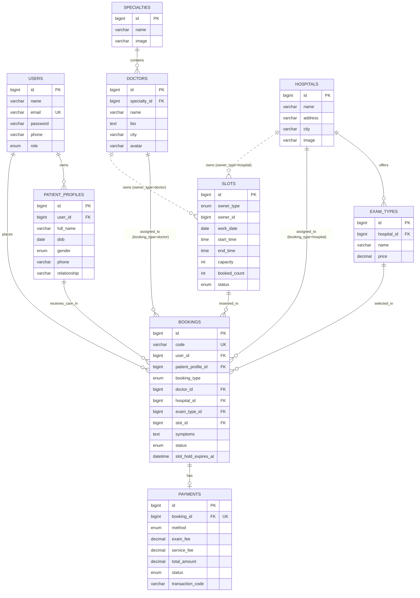

# Database Schema — YouMed-Mini

Tài liệu này là nguồn tham chiếu cho mô hình dữ liệu của YouMed-Mini. Các
migration và API phải dùng đúng tên bảng, tên cột và quan hệ dưới đây.

## ERD

## Bảng và quy tắc

| Bảng | Vai trò và ràng buộc chính |
|---|---|
| `users` | Tài khoản đăng nhập; `email` duy nhất; `role` gồm `user`, `admin`. Bác sĩ chưa phải là role tài khoản trong phiên bản hiện tại. |
| `patient_profiles` | Người được chăm sóc thuộc một tài khoản qua `user_id`; lưu thông tin người bệnh và quan hệ với chủ tài khoản. |
| `specialties` | Danh mục chuyên khoa, gồm tên và ảnh. |
| `doctors` | Hồ sơ bác sĩ thuộc một `specialty_id`; không gắn trực tiếp với tài khoản `users` trong schema này. |
| `hospitals` | Cơ sở khám, lưu tên, địa chỉ, thành phố và ảnh. |
| `exam_types` | Dịch vụ/loại xét nghiệm do bệnh viện cung cấp; `price` là phí khám của dịch vụ. |
| `slots` | Khung giờ dùng đa hình: `owner_type` là `doctor` hoặc `hospital`, `owner_id` trỏ tới thực thể tương ứng. `booked_count` không vượt quá `capacity`. |
| `bookings` | Lượt đặt lịch; `code` duy nhất. `booking_type` quyết định dùng `doctor_id` hay `hospital_id`/`exam_type_id`; luôn gắn user, hồ sơ bệnh nhân và slot. |
| `payments` | Tối đa một thanh toán cho mỗi booking (`booking_id` duy nhất); tổng tiền gồm `exam_fee`, `service_fee` và `total_amount`. |

Khi tạo hoặc hủy booking, cập nhật `slots.booked_count` trong cùng transaction
và khóa slot bằng `SELECT ... FOR UPDATE` để tránh vượt quá sức chứa. Booking
đang giữ chỗ có thể dùng `slot_hold_expires_at`; quy trình dọn giữ chỗ phải
giải phóng số lượng đã đặt khi thời hạn hết.
